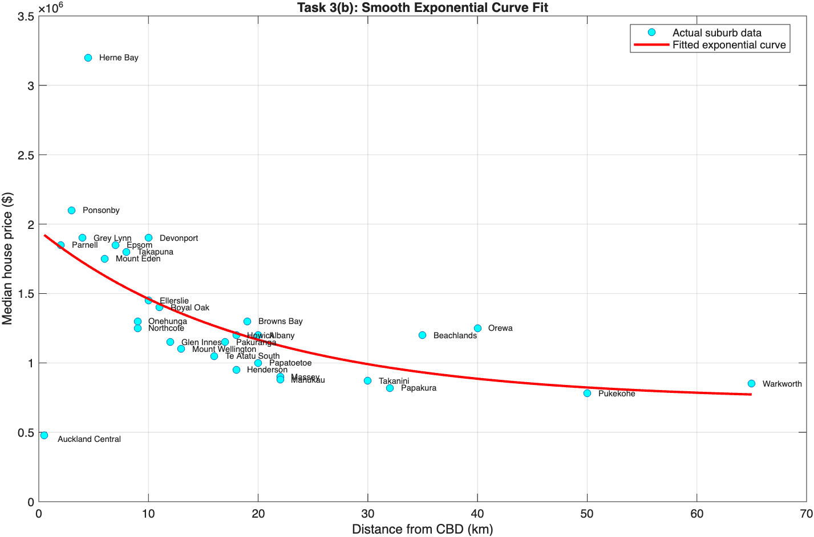
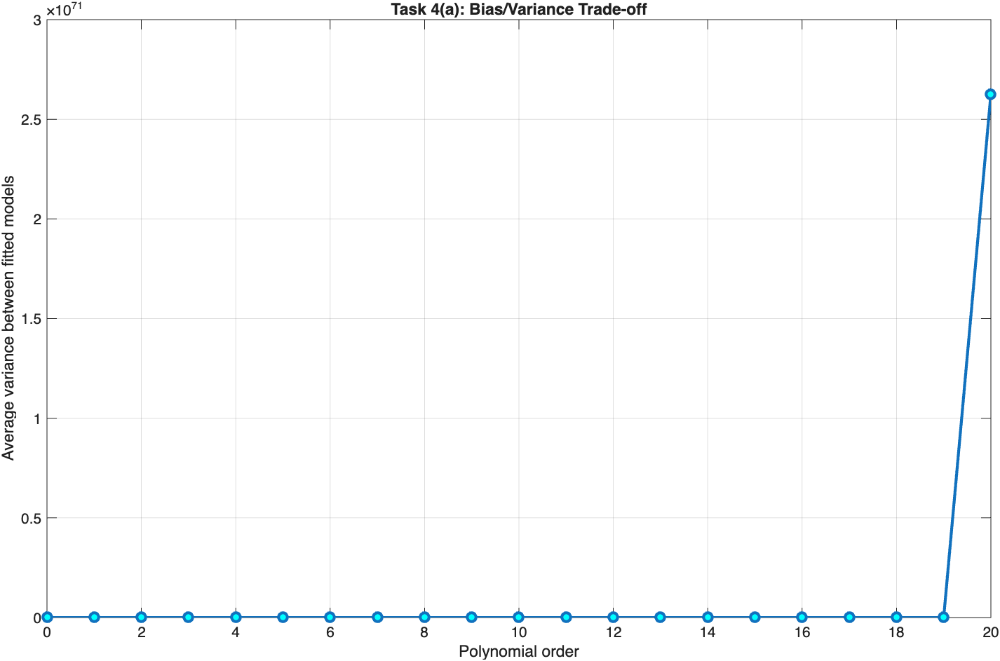
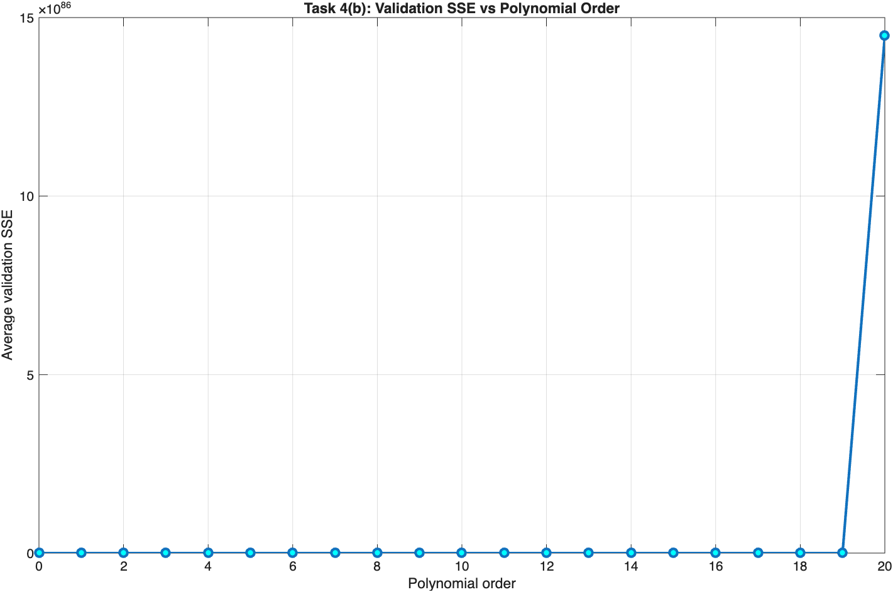
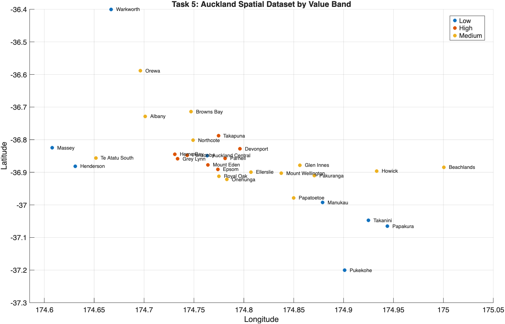
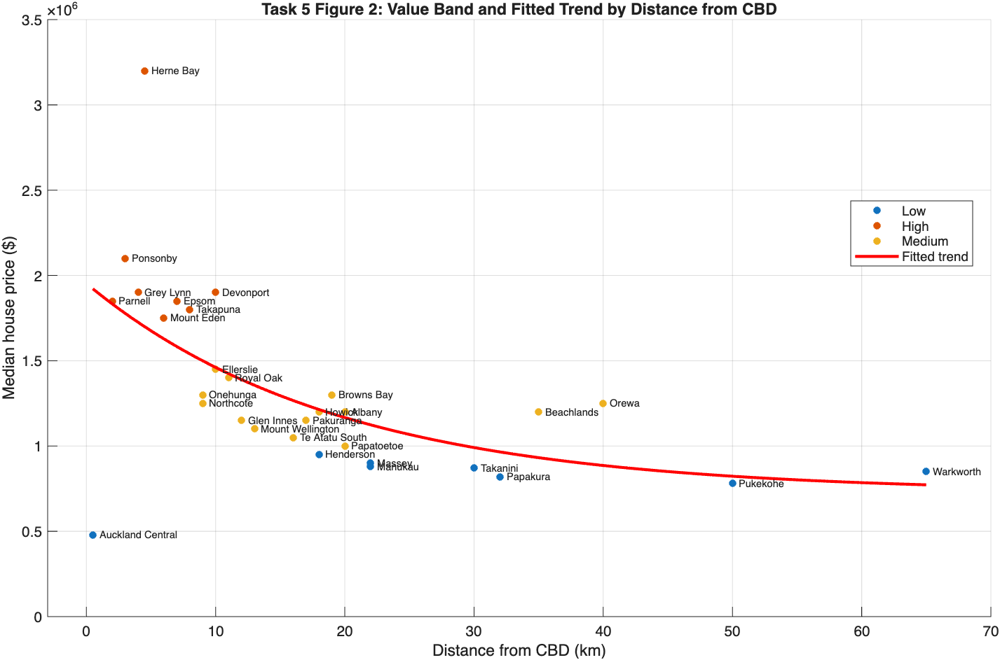
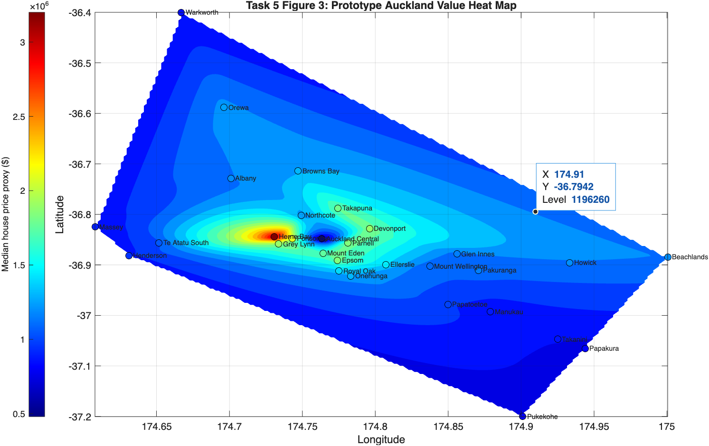

# MachineLearning Spatial Analysis — Auckland Housing Price

> Applied machine learning and geospatial analysis of Auckland residential land values using MATLAB.  
> Built as part of COMP717 Artificial Intelligence coursework at Auckland University of Technology (AUT), 2025.

---

## Overview

This project applies regression, curve fitting, and spatial interpolation to analyse how location drives residential land values across 30 Auckland suburbs. A custom spatial dataset was built from scratch with engineered features — latitude, longitude, CBD proximity score, coastal amenity flag, prototype land type, and value band — to support a practical town planning prototype.

The approach independently aligns with the spatial demand model published by Auckland Council's Chief Economist Unit in September 2025 (*"Where Auckland Wants to Live"*), which uses the same core methods: exponential decay with CBD distance, coastal amenity as a demand driver, and geospatial heat mapping.

**Key techniques:**
- Exponential decay curve fitting (`fminsearch`)
- Polynomial regression with bias/variance tradeoff analysis
- Custom spatial feature engineering
- Geospatial interpolation heat map (`griddata` + `contourf`)
- Interactive suburb value planner (nearest-neighbour lookup)

---

## Repository Structure

```
MachineLearning-Spatial-Analysis-AucklandHousingPrice/
├── README.md
├── data/
│   ├── Task5_Auckland_CustomSpatialDataset.csv   # Custom-built Auckland suburb dataset
│   └── AkldHousePrice.mat                        # Source Auckland house price data
├── src/
│   ├── Task3b_HousePriceFit.mlx                  # Exponential decay curve fitting
│   ├── Task4a.mlx                                 # Bias/variance tradeoff
│   ├── Task4b_ValidationSSE.mlx                   # Validation SSE analysis
│   └── Task5.mlx                                  # Spatial dataset + heat map + planner
├── images/
│   ├── exponential_curve_fit.png
│   ├── bias_variance_tradeoff.png
│   ├── validation_sse.png
│   ├── spatial_scatter.png
│   ├── price_distance_trend.png
│   └── geospatial_heatmap.png
└── references/
    └── where-auckland-wants-to-live.pdf
```

---

## Exponential Decay Curve Fitting

**Source:** `src/Task3b_HousePriceFit.mlx` | **Data:** `data/AkldHousePrice.mat`

Fits an exponential decay model to Auckland median house prices by distance from the CBD:

```
Price = θ₁ × exp(θ₂ × d) + θ₃
```

Optimised using MATLAB's `fminsearch` (Nelder-Mead unconstrained minimisation) with Sum of Squared Errors (SSE) as the loss function. Median price is used instead of mean because Auckland house price data is right-skewed — premium suburbs like Herne Bay and Remuera pull the average upward and distort the trend.

```matlab
modelFun = @(theta, d) theta(1) * exp(theta(2) * d) + theta(3);
errorFun = @(theta) sum((y - modelFun(theta, d)).^2);
theta0   = [2000000, -0.08, 800000];
thetaFit = fminsearch(errorFun, theta0);
```



Blue dots are actual suburb data. The red curve is the fitted exponential model. The curve starts high near the CBD and decays with distance — consistent with Auckland Council's own analysis (Figure 2, *Where Auckland Wants to Live*).

---

## Bias / Variance Tradeoff

**Sources:** `src/Task4a.mlx`, `src/Task4b_ValidationSSE.mlx`

Analyses overfitting behaviour across polynomial orders 0–20 using 100 random train/validation splits (70/30 ratio) on the Auckland house price dataset.



At low polynomial orders, variance is small — the model is stable but may underfit. As order increases, variance rises sharply. MATLAB also raises a badly-conditioned polynomial warning at high orders, confirming the model is too complex for the dataset size.



Validation SSE stays low across most orders, then spikes dramatically at order 20. This is a textbook overfitting result — the high-order polynomial memorises the training data but fails completely on unseen suburbs. A middle-order polynomial (3–5) generalises best.

---

## Geospatial Spatial Analysis & Interactive Planner

**Source:** `src/Task5.mlx` | **Dataset:** `data/Task5_Auckland_CustomSpatialDataset.csv`

### Custom Spatial Dataset

The original Auckland house price data only included suburb name, CBD distance, and median price. A custom spatial dataset was built for **30 suburbs** with **10 engineered features**:

| Feature | Description |
|---|---|
| `suburb` | Suburb name |
| `latitude` | Suburb-centre latitude (decimal degrees) |
| `longitude` | Suburb-centre longitude (decimal degrees) |
| `distanceCBD` | Straight-line distance from Auckland CBD (km) |
| `medianPrice` | Median house price ($) |
| `cbdProximityScore` | Normalised score — higher = closer to CBD |
| `distanceBand` | Central / Inner / Inner suburban / Middle suburban / Outer suburban |
| `coastalAmenityFlag` | 1 if coastal suburb (Herne Bay, Devonport, Takapuna, etc.), 0 otherwise |
| `prototypeLandType` | Coastal urban / Central urban / Suburban residential / Outer urban |
| `valueBand` | High (≥$1.7M) / Medium (≥$1M) / Low (<$1M) |

### Spatial Scatter Map

Plots all 30 suburbs by longitude and latitude, colour-coded by value band (High / Medium / Low). Shows immediately that high-value suburbs cluster around central and harbour-side Auckland — Herne Bay, Ponsonby, Parnell, Devonport, Takapuna — while lower-value suburbs spread to the outer south and west.



### Price by Distance with Trend Overlay

Plots median house price against CBD distance, colour-coded by value band, with the red exponential trend curve overlaid. Shows that distance alone does not fully explain value — coastal suburbs like Orewa and Beachlands sit above the trend due to lifestyle premium and local demand.



### Geospatial Heat Map

Interpolates value scores across the Auckland region using `griddata` (cubic method) and renders a continuous colour surface with `contourf`. Warmer colours (yellow, orange, red) indicate higher-value areas around central and inner Auckland. Cooler blues represent outer suburbs such as Pukekohe, Papakura, Henderson, and Warkworth.

```matlab
[Xq, Yq] = meshgrid(linspace(min(x),max(x),200), linspace(min(y),max(y),200));
Zq = griddata(x, y, z, Xq, Yq, 'cubic');
contourf(Xq, Yq, Zq, 20);
colormap(jet); colorbar;
```



This prototype heat map is directly comparable to the official Auckland Council land value heat map (Figure 1, *Where Auckland Wants to Live*), which was built from 2024 property valuations.

### Interactive Planner

A planner enters a latitude and longitude. The model returns:
- Land status check (valid urban land / possible sea or harbour / reserve or parkland)
- Nearest classified suburb (nearest-neighbour Euclidean lookup)
- Estimated value band (High / Medium / Low)
- Prototype land type and CBD proximity score

---

## Real-World Validation

Auckland Council's Chief Economist Unit published *"Where Auckland Wants to Live: What Land Values Tell Us About Demand for Housing"* (September 2025). Their spatial demand model uses 2024 property valuations and independently reaches the same conclusions built in this project:

- Exponential decay of land values with CBD distance
- Coastal amenity as a significant demand driver
- Zoning and land type influencing value
- A geospatial heat map with the same warm/cool colour pattern

> Blick, G., Li, C., & Stewart, J. (2025). *Where Auckland Wants to Live: What Land Values Tell Us About Demand for Housing.* Auckland Council Chief Economist Unit. Available in `references/` folder.

---

## Requirements

- MATLAB R2022a or later
- Optimization Toolbox (for `fminsearch`)

---

## How to Run

```bash
git clone https://github.com/All-Missing/MachineLearning-Spatial-Analysis-AucklandHousingPrice.git
```

Open any `.mlx` file in the MATLAB Live Editor and run cells sequentially (`Ctrl+Enter`).  
Start with `src/Task5.mlx` for the main spatial analysis and interactive planner.

---

## Course Context

**Course:** COMP717 — Artificial Intelligence  
**Institution:** Auckland University of Technology (AUT), 2025  
**Degree:** Bachelor of Computer and Information Sciences (BCIS)  
Major: Software Development | Minor: Artificial Intelligence (Data Science & Machine Learning)

---

## Author

**Josh Ma** — [github.com/All-Missing](https://github.com/All-Missing)
